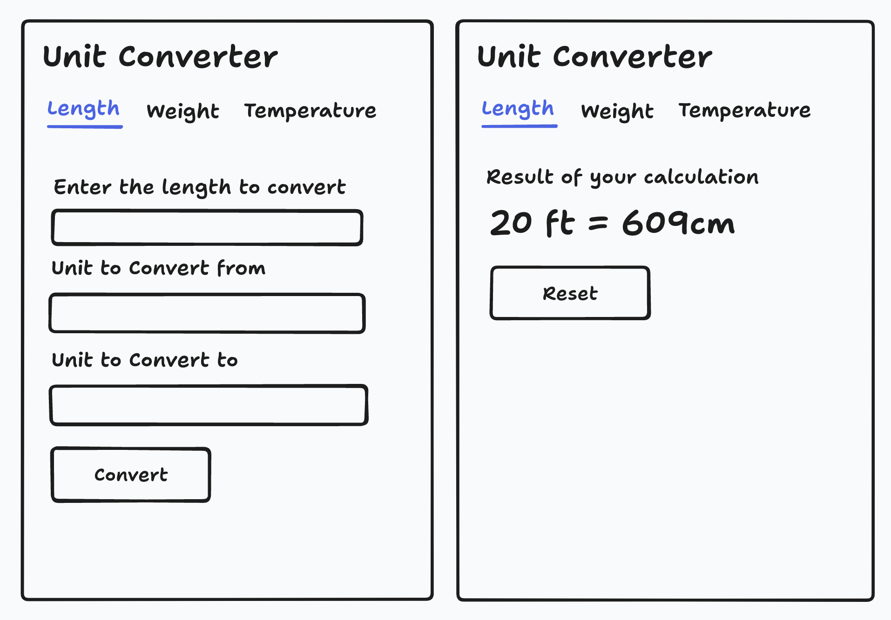

# Unit Converter
#### Unit converter to convert between different units of measurement.

You are required to build a simple web app that can convert between different units of measurement. It can convert units of length, weight, volume, area, temperature, and more. The user can input a value and select the units to convert from and to. The application will then display the converted value.

## Requirements

Build a simple web page that will have different sections for different units of measurement. The user can input a value to convert, select the units to convert from and to, and view the converted value.

- The user can input a value to convert.
- The user can select the units to convert from and to.
- The user can view the converted value.
- The user can convert between different units of measurement like length, weight, temperature, etc (more given below).
- You can include the following units of measurement to convert between:

### Supported units

| Category      | Units |
|---------------|-------|
| **Length**    | millimeter, centimeter, meter, kilometer, inch, foot, yard, mile |
| **Weight**    | milligram, gram, kilogram, ounce, pound |
| **Temperature** | Celsius, Fahrenheit, Kelvin |

---

## How it works

No database is required. The flow is:

1. The user fills out a form on a simple webpage.
2. The form is submitted to the server.
3. The server calculates the conversion and returns the result.
4. The page displays the converted value.

### Suggested structure

Use **three pages**—one each for length, weight, and temperature. Each page includes:

- A form to enter the value and select **from** / **to** units
- Form submission to the **same page** (`target="_self"`)
- Server-side logic: if the form was submitted, compute and show the result; otherwise, show the form only

Implement the backend in any language you prefer: detect form submission, perform the conversion, and render the result on the page.
