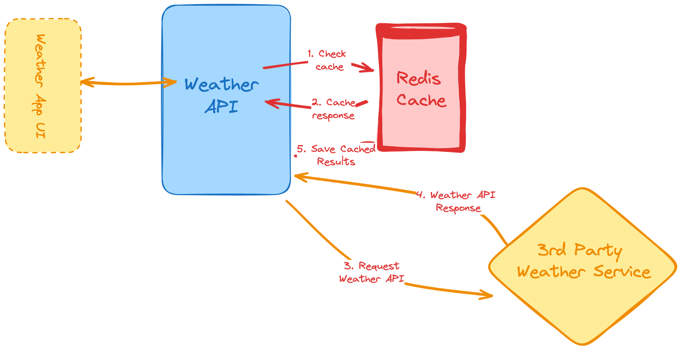

# Weather API

Build a weather API that fetches and returns weather data from a 3rd party service, with Redis caching for performance and rate limiting for protection.

## Overview

Instead of maintaining our own weather dataset, this project acts as a proxy — it receives a city name from the client, checks a Redis cache for recent data, and only calls the external weather service when needed. This keeps responses fast and reduces API usage.

This project will help you understand how to:

- Integrate with 3rd party APIs
- Implement server-side caching with Redis
- Manage secrets using environment variables
- Structure a RESTful API with proper error handling
- Apply rate limiting to protect your endpoints

## Architecture



The request flow works in 5 steps:

1. **Check cache** — When a request comes in, the Weather API first checks Redis for cached data using the city name as the key.
2. **Cache response** — If cached data exists and hasn't expired, it's returned immediately to the client. No external API call needed.
3. **Request Weather API** — If there's a cache miss (no data or expired), the server makes an HTTP request to the 3rd party weather service.
4. **Weather API Response** — The external service returns the weather data (temperature, humidity, conditions, etc.).
5. **Save Cached Results** — Before sending the response to the client, the server stores the result in Redis with a TTL (e.g. 12 hours), so subsequent requests for the same city are served from cache.

## API Endpoint

### `GET /api/weather?city={city_name}`

Fetches current weather data for the given city.

**Query Parameters:**

| Parameter | Type   | Required | Description          |
|-----------|--------|----------|----------------------|
| `city`    | string | Yes      | City name to look up |

**Success Response (200):**

```json
{
  "city": "London",
  "temperature": 18.5,
  "humidity": 72,
  "conditions": "Partly cloudy",
  "wind_speed": 12.3,
  "cached": false
}
```

**Error Responses:**

| Status | Reason                                    |
|--------|-------------------------------------------|
| 400    | Missing or invalid `city` parameter       |
| 404    | City not found by the weather service     |
| 429    | Rate limit exceeded                       |
| 500    | Weather service unavailable / server error|

## Prerequisites

- **Node.js** 18+ (or Python 3.9+)
- **Redis** installed and running ([install guide](https://redis.io/docs/getting-started/installation/))
- A free API key from a weather service (see below)

## Environment Variables

Create a `.env` file in the project root:

```env
PORT=3000
WEATHER_API_KEY=your_api_key_here
WEATHER_API_BASE_URL=https://weather.visualcrossing.com/VisualCrossingWebServices/rest/services/timeline
REDIS_URL=redis://localhost:6379
CACHE_TTL_SECONDS=43200
```

| Variable               | Description                                 | Default                |
|------------------------|---------------------------------------------|------------------------|
| `PORT`                 | Port the server listens on                  | `3000`                 |
| `WEATHER_API_KEY`      | API key from your weather service provider  | —                      |
| `WEATHER_API_BASE_URL` | Base URL for the weather API                | —                      |
| `REDIS_URL`            | Redis connection string                     | `redis://localhost:6379`|
| `CACHE_TTL_SECONDS`    | How long cached data lives (in seconds)     | `43200` (12 hours)     |

## Weather API Provider

You can use any weather API you prefer. A recommended option is [Visual Crossing's Weather API](https://www.visualcrossing.com/weather-api) — it's completely free and straightforward to set up. Sign up, grab your API key, and add it to your `.env` file.

## Redis Caching Strategy

Use the **city name** (lowercased, trimmed) as the Redis key, and store the full API response as the value.

When setting a value, use the `EX` flag to set an expiration time in seconds:

```
SET "london" "{...weather data...}" EX 43200
```

This way keys automatically expire after the TTL (12 hours by default), and the next request for that city will fetch fresh data from the external API.

**Why Redis?** In-memory storage makes lookups extremely fast (sub-millisecond), and built-in TTL support means you don't need to write any cache invalidation logic yourself.

## Project Structure

```
weather_api/
├── server.js           # Entry point, starts the HTTP server
├── routes/
│   └── weather.js      # GET /api/weather route handler
├── services/
│   ├── weatherService.js   # 3rd party API integration
│   └── cacheService.js     # Redis get/set/TTL logic
├── middleware/
│   └── rateLimiter.js      # Rate limiting middleware
├── .env                # Environment variables (not committed)
├── .env.example        # Template for .env
├── package.json
└── README.md
```

## Setup & Run

```bash
# install dependencies
npm install

# make sure Redis is running
redis-cli ping   # should print PONG

# start the server
npm run dev
```

Then test with:

```bash
curl "http://localhost:3000/api/weather?city=London"
```

## Tips

- **Start simple** — Begin with a hardcoded JSON response to get your routing and response structure right before wiring up the external API.
- **Use environment variables** — Never hardcode API keys or connection strings. Use `dotenv` (Node.js) or `python-dotenv` (Python) to load from `.env`.
- **Handle errors gracefully** — The 3rd party API can be down, return unexpected formats, or reject invalid city names. Wrap external calls in try/catch and return meaningful error messages with appropriate status codes.
- **HTTP client** — Use `axios` or the built-in `fetch` (Node.js 18+) for making HTTP requests. For Python, use the `requests` module.
- **Rate limiting** — Protect your API from abuse. Use `express-rate-limit` (Node.js) or `flask-limiter` (Python) to cap requests per IP.
- **Logging** — Log cache hits vs misses so you can monitor how effective your caching is.
